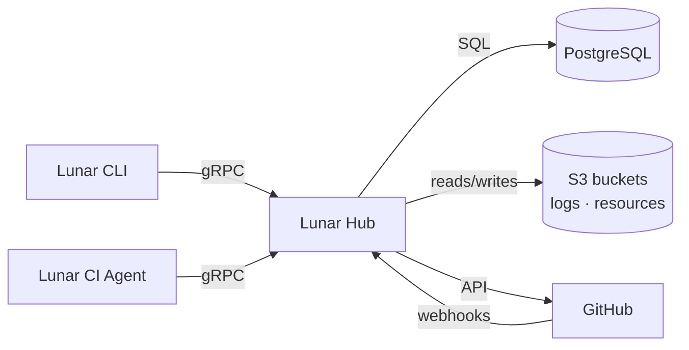
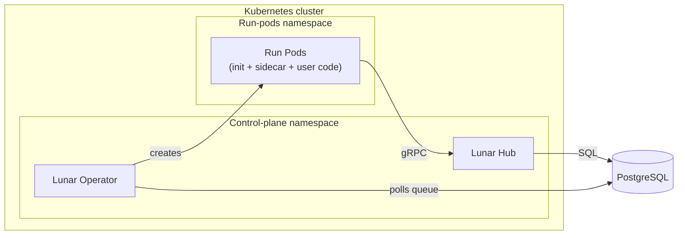

# Lunar Hub Overview

This page is a high-level overview of what a Lunar Hub deployment looks like on Kubernetes. It's meant to provide a conceptual overview of the system before you dive into the installation process. When you're ready to install, start by setting up the [prerequisites](hub-prereqs.md).

## What you're installing

A Lunar deployment primarily consists of:
 * the Lunar Hub (a Kubernetes service)
 * the Lunar Operator (a Kubernetes controller)
 * a fleet of transient policy/cataloger/collector batches managed by the operator
 * and three external dependencies you provide (PostgreSQL, S3, and a GitHub App)

### External boundaries

#### Hub

This is the central API server. It:

 * talks to Postgres, GitHub, and S3
 * serves the gRPC API consumed by the CLI, CI agents, and the Lunar operator
 * receives GitHub webhooks on its HTTP port
 * issues pre-signed S3 URLs for bulk data (run resources, run logs) transferred between work units orchestrated by the operator

For more details on how this hooks into the rest of the system, see [Ports and protocols](#ports-and-protocols) below.

#### Lunar CLI

The `lunar` binary. Used by platform engineers to push configuration, inspect components, and run collectors/policies locally. [This is installed separately.](cli.md).

#### Lunar CI Agent

Instruments your CI runners to report data to the Hub. This is also installed separately. We support [Self-hosted GitHub Actions](agent-self-hosted.md) and [Managed GitHub Actions](agent-managed.md) options.

### Inside the cluster

#### Lunar Operator

A Kubernetes controller that groups enqueued runs into batches and materializes each batch as a short-lived Kubernetes pod. It manages the whole lifecycle of these pods, from creation to cleanup.

#### Run pods

Short-lived batch pods. The init container fetches needed data from S3 and GitHub and coordinates the user containers. User containers execute the specified cataloger, collector, or policy. The sidecar streams each container's logs to S3 and reports exit codes back to the Hub over gRPC.

Splitting the control plane (Hub + operator) and run pods into separate namespaces is recommended. This provides different blast radius, different resource profile, and different RBAC for distinctly different pieces of the system. Single-namespace installs also work; see [Step 1](hub-prereqs.md#step-1--plan-your-kubernetes-namespaces) of the prerequisites for details.

### Grafana

The chart ships a pre-built Grafana instance with dashboards for policy results, component health, and collection activity. It reads from the same Postgres database as the Hub. Grafana is the primary UI for Lunar today and is **enabled by default in the chart**; [install Step 4](hub-install.md#step-4--write-valuesyaml) shows how to wire up its ingress. Admin credentials are auto-generated on first install. To disable Grafana, set `grafana.enabled: false`; full configuration is in the [chart README](https://github.com/earthly/charts/blob/main/README.md#grafana).

## Networking

### Connectivity

Use this table when planning ingress rules, egress allowlists, and NetworkPolicies. Specific Hub ports are detailed in the [next section](#ports-and-protocols).

| Source | Destination | Direction | Purpose |
|---|---|---|---|
| GitHub | Hub HTTP ingress | Inbound | Webhook delivery |
| CLI / CI agents | Hub gRPC ingress | Inbound | API calls (config sync, results) |
| CLI / CI agents | Hub HTTP ingress | Inbound | Pre-signed log URL fetches |
| Hub | GitHub API | Outbound | Read repos, post checks/comments |
| Hub | Postgres | Outbound | Hub state (incl. work queue, migrations) |
| Hub | S3 | Outbound | Run pod resource uploads |
| Operator | Postgres | Outbound | Poll work queue (own schema) |
| Run pods | S3 | Outbound | Upload logs, download resources |
| Run pods | Hub Service | In-cluster | Exit codes (gRPC); log URL fetches (HTTP) |

### Ports and protocols

The Hub listens on three ports inside the pod. Only two are exposed externally; the third is for in-cluster health probes.

| Port | Protocol | Purpose | Who talks to it |
|---|---|---|---|
| `8000` | gRPC | API — config sync, policy evaluation, run results | CLI, CI agents, run pods (sidecar) |
| `8001` | HTTP | GitHub webhook receiver + pre-signed URL redirector for run logs | GitHub, CLI, CI agents, sidecar |
| `8002` | HTTP | Liveness / readiness probes (`GET /health`) | Kubelet only |

The HTTP port serves exactly two path prefixes: `/webhooks/github` (webhook ingestion) and `/logs/runs/` (redirects to pre-signed S3 URLs for log upload/download). No other HTTP routes exist. The Hub does not currently expose Prometheus metrics; observability is via OpenTelemetry (OTLP).

## Next steps

- [Prerequisites](hub-prereqs.md) — external dependencies you need in place before `helm install`.
- [Install walkthrough](hub-install.md) — step-by-step from zero to a working Hub.
